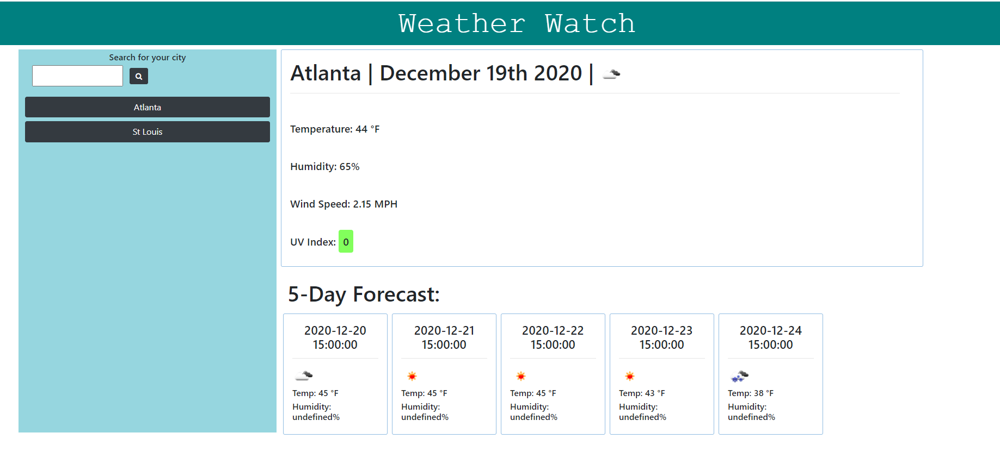

# Weather Watch
Would you like to check the weather in your city?  Type the city name in the search box and click enter to see current and future weather conditions.

This app was created using HTML, CSS, JavaScript, and API https://openweathermap.org/api which provides weather data.  Moments.js was used to populate dates and local storage is used to save search history.

# Deployed
Repo Link:  https://github.com/DesCoding/WeatherWatch.git

Site Link:  https://descoding.github.io/WeatherWatch/index.html

# Demo

